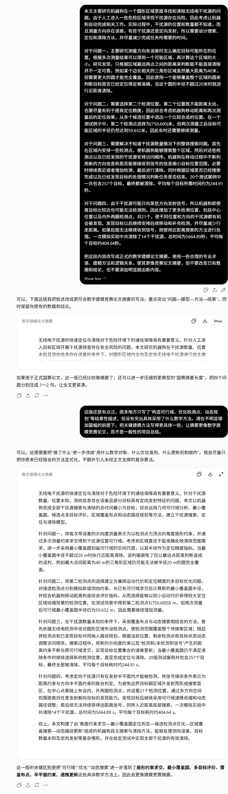

# AI工具使用详情

本文件用于整理我们的 AI 工具使用情况。在本次建模过程中，我们将 AI 作为辅助工具，由我们主导问题理解、模型构建、算法方案选择、结果分析和论文定稿，并对论文内容的准确性与完整性承担责任。

## 工具信息

| 项目 | 填写内容 |
| --- | --- |
| 工具名称 | DeepSeek网页端，DeepSeek-Harness；GPT 系列工具 codex |
| 版本或型号 | deepseek-v4.1-flash；gpt-5.6-sol；gpt-6-astra |
| 使用日期 | 2026-09-10 至 2026-09-13 |

## 具体使用目的和环节

1. **拆解题意。**

   我们在阅读题目并形成初步理解后，使用 deepseek-v4.1-flash 辅助整理四个问题的已知条件、待求目标及约束关系。输入内容包括题目原文、我们对测向误差和接收条件的理解，以及需要澄清的概念；输出是分问题的条件清单和概念对照说明。我们据此检查自己的题意理解，决定各问题的研究重点。

   **对应论文位置：**第一章“问题重述”、第二章“问题分析”，以及第五章“问题一：基于半平面交的定位区域计算”中“测向误差与定位区域的几何表示”。具体涉及测向扇区与半平面约束的关系、区域直径与最小包围圆的区别，以及搜索、定位、清除三个任务的区分。

2. **在我们的思维基础上实现代码。**

   我们先确定数学模型、算法流程和输入输出要求，再使用 gpt-6-astra 辅助将这些思路转化为程序。输入内容包括我们推导的约束、伪代码、数据结构及接口说明；期望输出是相应函数的初稿、边界情况提示和针对运行报错的修改建议。算法选择、约束设置、调度规则及终止条件由我们确定，我们负责整合代码并通过运行结果检查实现是否符合原方案。

   **对应支撑材料位置：**拟整理至附录“问题一、二几何计算程序”和“问题三、四搜索清除程序”（附录编号、文件名及函数名：[待填]）。代码分别实现正文第五、六章的定位区域计算与第二检测点选择，以及第七、八章的连续覆盖、可行域更新和扫描清除联合调度。

3. **润色表达。**

   我们完成推导、结果整理和文字初稿后，使用 gpt-5.6-sol 辅助检查长句、术语不统一和段落衔接问题。输入为我们已经写出的段落及必要的公式、表格上下文；期望输出是保留数学含义、数值和证据范围的修改稿。我们决定最终措辞，并检查修改是否改变原意。

   **对应论文位置：**论文全文，包括摘要、问题重述、问题分析、模型假设与约定、符号说明、各问题的模型建立与求解、实验结果分析、模型检验及模型评价等部分。润色对象是论文的语言表达，不涉及新增模型、推导、实验或结论。

## 主要提示方式与使用过程

我们先提供题设、已有思路或论文草稿，再明确需要 AI 协助的局部任务及输出要求。收到建议后，我们结合自己的理解进行取舍，并针对存在的问题补充说明、继续修改。以下是一个摘要语言润色的提示与迭代示例。

**首次提示：**

> [粘贴原文]。把这段内容改写成正式的数学建模论文摘要。使用一些合理的专业术语、建模方法和逻辑关系，使其更像竞赛论文摘要，但不要改变已有数据和结论，也不要添加明显超出新内容，并简要说明主要修改。

**反馈与迭代：**

> 这版还是有点泛，很多地方只写了“构造可行域、优化检测点、动态规划”等结果性描述，但没有突出具体采用了什么数学方法。请在不明显增加篇幅的前提下，把关键建模方法写得更具体一些，让摘要更像数学建模竞赛论文，而不是一般性的项目总结。

我们逐字审阅修改建议，确定最终表达。实际部分提示记录：

## 采纳、人工修改与核验

### 1. 题意整理：定位区域直径与圆覆盖条件

- **AI 输出是否采纳：**部分采纳。保留 AI 对测向误差、定位区域和区域直径的条件整理；未采纳其将“区域直径不超过 40 米”直接作为单点光学覆盖条件的解释。
- **由谁进行何种人工修改：**负责几何建模的队员重新推导圆覆盖条件，将直径计算与最小包围圆计算分开，改为以最小包围圆半径不超过 20 米判断可靠单点覆盖；负责写作的队员据此修改第五章的解释。
- **采用何种数据或实验复核：**使用第五章“同直径圆的覆盖问题”中的边长 40 米等边三角形算例，人工计算其直径为 40 米、最小包围圆半径为 40/√3≈23.094 米，并与该章算例表比较。该区域不能被半径 20 米的圆覆盖。
- **最终结论是否变化：**相对于 AI 初稿，覆盖条件的结论发生变化，由直径判断改为包围圆半径判断；区域直径的定义和计算方法保留。我们最终采用修正后的判据。

### 2. 代码实现：第二检测点的候选比较

- **AI 输出是否采纳：**修改后采纳。采用 AI 按我们给定的四圆约束和候选评分流程编写的遍历代码，未采用仅凭有限网格评分就称所选点为“全局最优点”的结果说明。
- **由谁进行何种人工修改：**负责问题二程序实现的队员将接收约束筛选与定位半径评分分开处理，按既定方案把沿线点 (500,0) 作为退化对照，不参与正常离轴候选选择；负责问题二建模的队员核对筛选条件，并将结果解释限定为本次候选集合内的比较。
- **采用何种数据或实验复核：**采用第六章首检测点为原点、示向度为 0° 的规范化算例，先按每个候选 162 个设计场景比较，再对选中点使用 63 个距离节点和 5×5 组角偏差、误差组合加密复核。对照该章结果，选中点为 (750,600) 米，加密前后的最坏采样半径均约为 59.631950 米；另外比较镜像候选，检查评分是否符合几何对称性。
- **最终结论是否变化：**复核未改变选中点及所报告的最坏采样半径，但收窄了结论范围：只报告有限候选比较结果，不声称连续区域全局最优。由于该半径仍大于 20 米，也不据此得出两次测向必然可以单点清除的结论。

### 3. 代码实现：清除反馈与终止判断

- **AI 输出是否采纳：**部分采纳。采用 AI 根据既定策略编写的扫描、定位和清除流程框架，对清除成功的状态更新及退出条件进行人工修改后再整合。
- **由谁进行何种人工修改：**负责搜索清除程序的队员将“已发出清除指令”和“已收到清除成功反馈”分开，只有后者才计入已清除集合；同时补充源数不足 16 个时的检查，要求完成剩余未知频道的覆盖检测并清除全部已发现源后才退出。负责搜索策略的队员对照第七、八章的终止条件复核这些分支。
- **采用何种数据或实验复核：**采用第九章列出的近场发现第十六个源、十五源场景完整扫描等针对性案例，逐条检查检测记录和成功清除反馈；再对照该章 44 次 HTTP 求解的动作计时核验，检查清除计数和分项耗时。正文报告这些运行累计 568 个源均有成功清除反馈，分项时间与模拟器总时间的最大差为 5.68×10⁻⁶ 秒。
- **最终结论是否变化：**人工修改使代码的完成判定与我们提出的模型一致，未改变模型要求的终止条件。上述测试用于支持修改后程序在所测案例上的执行结果。

## 人工核验清单

- 我们已核对公式推导、单位、边界条件和符号的一致性。
- 我们已在独立环境中运行全部代码并复现论文表图。
- 我们已核验引用、数据来源和事实陈述。
- 我们已确认核心建模与分析由我们主导，使用说明与实际分工一致。
- 我们确认论文声明与本详情文件一致
